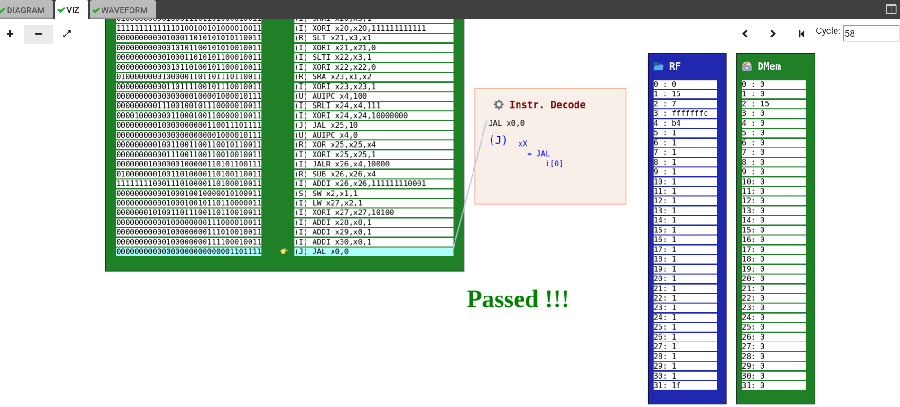
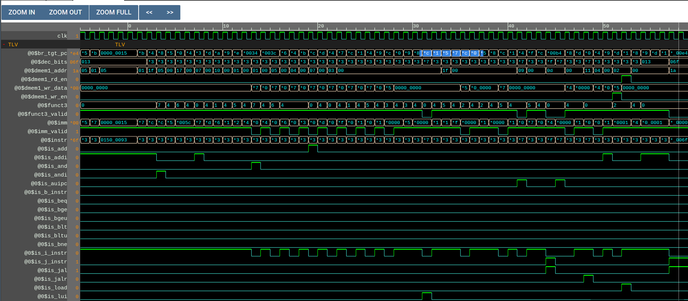
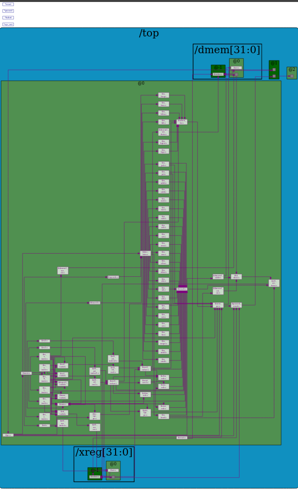

# Building A RISC-V CPU

This repo contains my work while completing the course [LFD111x](https://www.edx.org/course/building-a-risc-v-cpu-core): Building a RISC-V CPU Core.

## About

I have completed creating a CPU Core using the open source ISA [RISC-V](https://riscv.org/). It contains the basic functionalities which include arthimetic operations, control flow and memory management.

To view the functionalities breakdown for each chapter, please refer to the respective directories.

## Acknowledgments

I am thankful for the Linux Foundation for creating and putting this course out for free. I have truly learnt a lot. I am also thankful of the various educational institutions who have posted their RISC-V slides online.

I am also grateful for [Makerchip](https://app.makerchip.com/), RedWood EDA LLC for the wonderful and beginner friendly IDE to learn TL-Verilog.

## Screenshots

### Waveforms

### CPU Diagram

