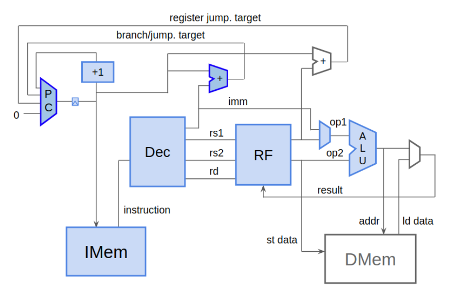
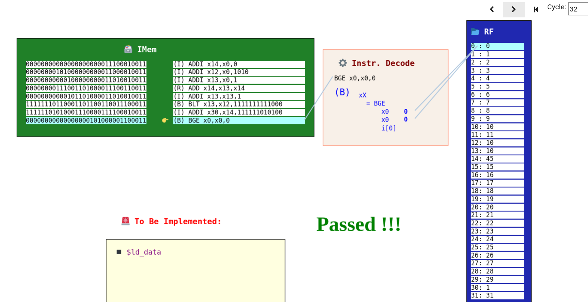
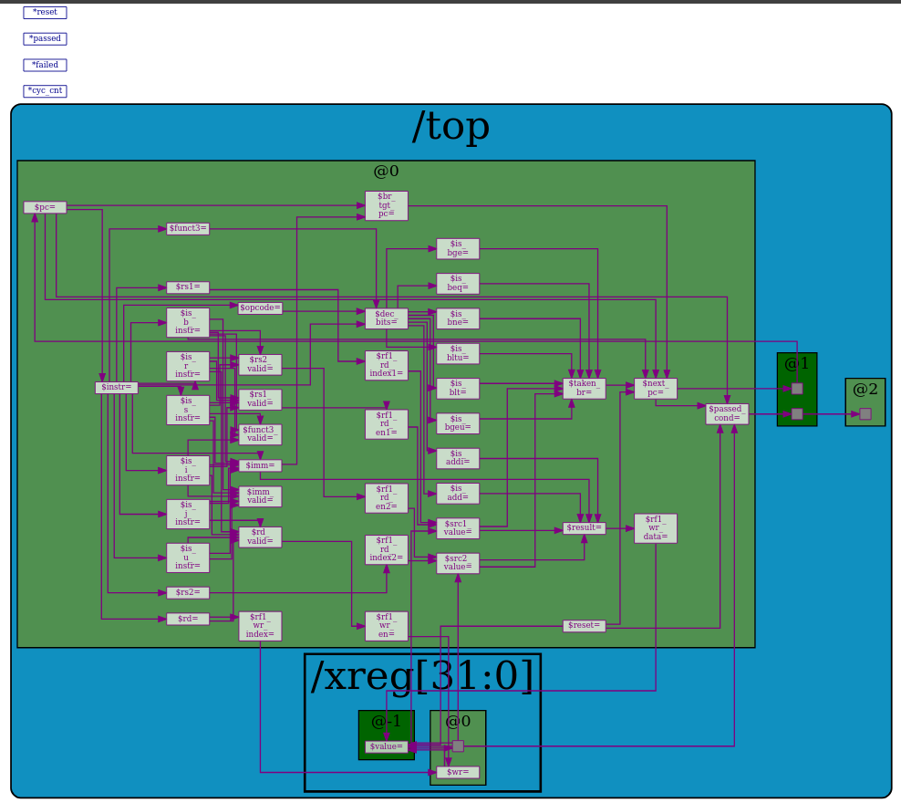

# Chapter 4

This directory contains the TL-Verilog code which completes the requirements as of Chapter 4.

## Progress

The blue highlighted region indicates the functionalities which are completed.

## Visualisation

## CPU View

